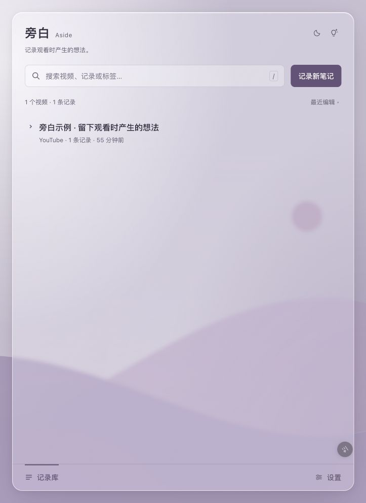
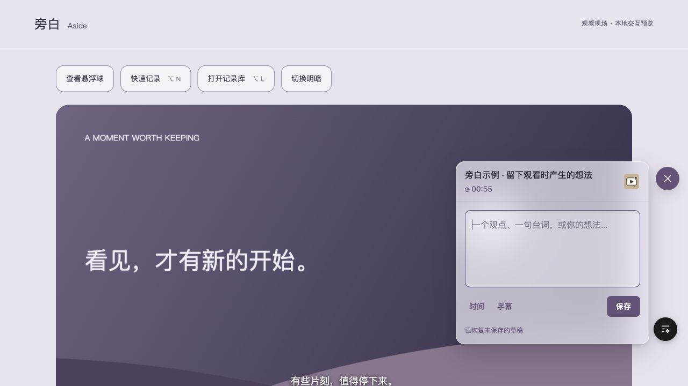

# 旁白 · Aside

> 观影笔记，记录你观影时的旁白。

一个 Chrome 扩展 + 渐进式 Web 应用（PWA）组合，看电影、访谈或视频播客时一键捕捉视频时间、留下想法，支持 Markdown / Notion 导出与多端云同步。

---

## 为什么叫「旁白 · Aside」

> **Aside** — 戏剧中演员转向观众的独白；**旁白** — 电影里向观众讲述的另一重声音。
>
> 写下来的那一刻，你既在看戏，也在向自己讲戏。

## 功能

- 播放器底栏旁白入口：`Alt/Option + N` 打开 / 收起底部记录窗，自带当前时刻戳与截图
- 悬浮记录库：覆盖在网页上，可拖动；与快速记录窗口互斥，切换保留草稿
- 下拉预览：按视频展开，展示时间、正文与标签；截图和分享等功能保留在详情页
- 完整标签页：可从悬浮主页右上角 ↗ 主动打开；浏览器受限页面回退到同一浏览器窗口内的标签页，不再弹出独立小窗
- 搜索：同时命中视频标题、标签、记录内容与条目标签
- 同步：Google 账号一键登录，基于 Supabase 的多端同步
- 导出：单部或全部笔记 → Markdown / Notion
- 分享：生成品牌分享卡片（含二维码直达视频时刻）

## 当前源码版本 · 1.9.10



日轮与山形曲线位于整页底层，记录库透过玻璃呈现；观看时使用播放器底栏入口与底部快速记录窗，不离开视频。默认深色，支持手动切换浅色、临时拖动调整位置、窗口缩放、键盘操作和草稿恢复。悬浮首页移出鼠标后自动收起，右上角可固定并记住偏好。



截图来自本地示例预览，使用示例数据；具体交互以当前源码为准。

- **体验最新插件**：[Releases](https://github.com/ruimin922/aside/releases) → 下载 `aside-v版本.zip`。
- **本次改动与安装说明**：[1.9.10](docs/RELEASE-1.9.10.md)。本地包由 `npm run package` 生成；GitHub Releases 中的版本以实际发布为准。
- **设计过程**：[定位与交互](DESIGN-UPGRADE.md) · [视觉系统](DESIGN-1.8.md) · [首页信息层级](DESIGN-1.8.4.md)。历史文档记录当时的取舍，当前实现以最新版本为准。
- **工程与维护**：[本地可靠性与云同步](TECHNICAL-UPGRADE.md) · [迭代发布流程](docs/MAINTAINING.md)。

## 产品思路

观看时的想法往往短暂，切到另一个应用会打断注意力。旁白把“留下想法”的操作放在视频旁，把“回顾与整理”放在记录库：时间点、正文和标签是核心，截图与导出在需要时出现。

最近一轮围绕这个取舍持续细化：降低快捷键说明与提示的视觉重量，保留操作的可发现性；首页增加背景层次，悬浮窗口则透出实际网页。开发时通过 Agentation 收集批注，在同一份正式源码上迭代。

## 验证范围

`npm test` 目前包含 77 项本地数据、后台、数据库、Notion、播放器定位、同步反馈与帮助交互检查。界面通过本地预览检查；这不等于所有视频网站、Google 登录、线上云同步或 Notion 导出均通过实际扩展验收。当前没有在此仓库声明未核实的用户规模或线上效果。

## 安装（开发者模式）

### 使用 Agentation 标注页面

首次先运行 `npm ci`，再在项目目录运行 `npm run dev:agentation`，打开 [本地记录库预览](http://127.0.0.1:4173/movie-notes-extension/panel.html)，点击右下角 Agentation 按钮添加批注，再让 Codex「读取旁白的 Agentation 批注并修改」。预览使用当前源码和独立示例数据，修改源码后刷新即可。首次使用全局 MCP 需要重启 Codex。详细范围和 PWA 入口见 [接入说明](dev/agentation/README.md)。

### 加载 Chrome 扩展

1. 打开 `chrome://extensions`
2. 右上角开启 **开发者模式**
3. 点击 **加载已解压的扩展程序**
4. 选择目录 `movie-notes-extension/`
5. 打开支持的平台视频页（YouTube、B 站、爱奇艺、优酷、芒果、腾讯视频）
6. 点击扩展图标打开悬浮记录库；不会挤压网页

> 每次改完代码后需要在 `chrome://extensions` 点 **重新加载**，并刷新视频页面（Content Script 才会更新）。已有开发者版本请覆盖原文件夹后重新加载，不要先删除插件。

源码自带插件目录，不需要构建即可加载。运行 `npm run package` 会生成仅包含插件运行文件的 ZIP；私钥、示例数据、Agentation 与开发依赖均不进入包。

## 使用

### 快捷键

使用帮助 → 查看全部快捷键，可进入 Chrome 设置修改打开记录与记录库的浏览器级绑定。升级后若 Chrome 保留旧绑定，请在 `chrome://extensions/shortcuts` 将记录库设为 Alt/Option + L；帮助页显示实际生效的绑定。Alt + S / T 为编辑器内部快捷键，不占用浏览器全局绑定。

- Alt/Option + L：打开或收起记录库
- Alt/Option + N：打开 / 收起快速记录；收起保留草稿，不会自动保存为记录
- Alt/Option + S：在快速记录或新建记录编辑器内，在光标处插入字幕
- Alt/Option + T：在编辑器内更新时间戳；时间段模式更新聚焦的终点，否则更新起点
- 旁白窗口内、未输入时：`/` 搜索、`N` 新建、`S` 设置、`L` 返回记录库、`?` 帮助
- Command/Ctrl + Enter：保存；视频页的 Esc 留给播放器

### 播放器底部快速记录

- **打开**：`Alt/Option + N` 或点击播放器底栏的旁白按钮
- **保存**：`⌘/Ctrl + Enter`，或点击「保存」
- **关闭**：再次按 `Alt/Option + N` 或点击右上角「×」；未保存内容自动保留为草稿

#### `/ 标签行` 语法

在弹层任意一行以 `/` 或 `／` 开头，会被识别为记录标签：

```
这一段的剪辑节奏很奇妙。
/意识流 女性 新浪潮
```

保存后标签写入该条心得并从正文中移除。

### 连接 Notion

在插件的「设置 → 连接 Notion」跟随三步引导：创建内部连接并启用读取和插入内容权限 → 将目标普通页面添加给该连接 → 点击「验证并连接」。验证会实际创建一条无笔记内容的测试页面，成功后保存设置；已保存的旧配置保留，但显示为「待验证写入」。

成功后显示目标页面与测试页面链接。导出结果持续显示完成、失败和未开始的数量；权限、网络与内容格式错误附有处理办法。修改中的设置不会被旧配置覆盖，也不会被直接用于导出。

完整步骤与排查见 [Notion 连接指南](docs/NOTION.md)。这是手动密钥连接，尚未提供面向用户的一键 OAuth 授权；本地 Agentation 预览不能连接真实 Notion 账号。

## 目录结构

```
movie-notes/
├── movie-notes-extension/      Chrome 扩展（MV3）
│   ├── manifest.json
│   ├── background.js
│   ├── content.js
│   ├── panel.html / panel.js / panel.css / design.css
│   ├── share.html / share.js / share.css
│   └── utils/{storage,supabase,sync,common}.js
├── movie-notes-pwa/            移动端浏览查看器
├── LICENSE                     GNU AGPL-3.0
└── README.md
```

## 技术栈

- Chrome Extension MV3：Service Worker + 扩展 iframe 悬浮窗 + Content Script
- Supabase（Postgres + Auth）：Google OAuth via PKCE (`chrome.identity.launchWebAuthFlow`)
- 本地优先存储：`chrome.storage.local` + `unlimitedStorage`；截图独立键以避免单键膨胀
- ES Modules（`panel.js` / `background.js` / `utils/*.js`），Content Script 仍用经典脚本

## 常见问题

- **改完代码仍是旧行为**：`chrome://extensions` → 重新加载；刷新视频页面
- **快速记录保存失败**：看 Service Worker 控制台；若存储偏满会自动降级为仅文字
- **同步后换设备没数据**：登录后强制执行过一次历史数据补推；若仍缺，可在设置页查看同步状态

## 作者

**钱瑞敏**（qian）
- 邮箱：[ruiminqian92@gmail.com](mailto:ruiminqian92@gmail.com)
- GitHub：[@ruimin922](https://github.com/ruimin922)

欢迎 issue / PR。Bug、功能建议、设计反馈都可以直接邮件。

## 许可证

本项目采用 **GNU Affero General Public License v3.0 (AGPL-3.0)** 开源 —— 完整条款见 [`LICENSE`](./LICENSE)。

简单说：
- 你可以自由使用、修改、自部署
- 如果你基于本项目二次开发并对外提供服务（包括托管版 SaaS），你必须以相同协议公开你的修改版源代码
- 选择 AGPL 是为了让这份持续维护的作品，在被"复刻改名"时仍能把改动回馈社区

Copyright © 2026 钱瑞敏 (Qian Ruimin)

播放器适配覆盖 YouTube、哔哩哔哩、爱奇艺、优酷、芒果 TV、腾讯视频。无法识别网站底栏时，入口退到视频底部，播放中闲置会淡出。记录窗可临时拖动调整位置，重新打开时跟随底栏的旁白按钮定位，并尽量避让字幕；草稿静默恢复。站点 DOM 改版可能触发回退。
